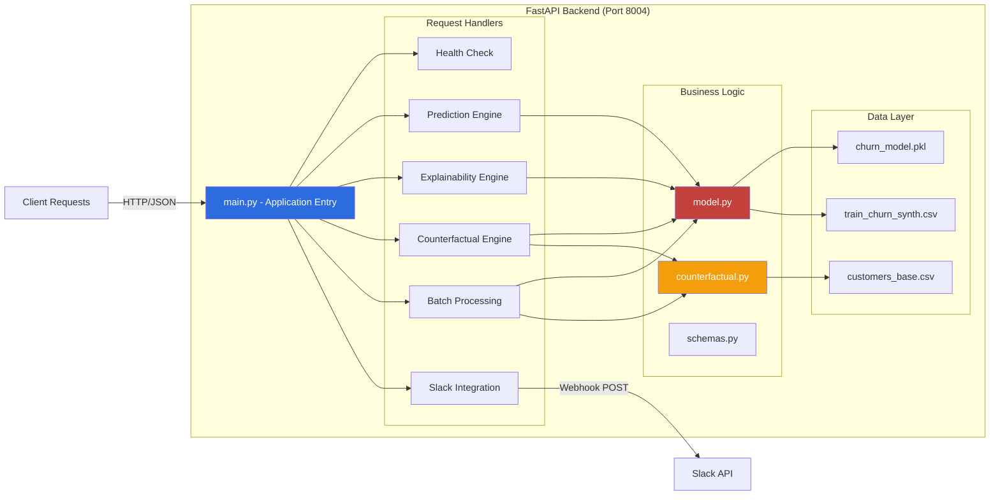

# Counterfactual Command Center — Tableau Cloud E2E

A world-class, hackathon-grade end-to-end solution for Tableau Cloud + AI. This project demonstrates how to integrate real-time Machine Learning and Counterfactual Analysis directly into the flow of work using the Tableau Developer Platform.

## 🚀 "World-Class" Features
- **Predictive Churn Engine**: Uses a HistGradientBoosting model to predict churn risk based on 30-day behavior metrics.
- **Explainable AI (XAI)**: Integrated global feature importance charts to show *why* the model predicts high risk (Explainability).
- **Interactive "What-If" Simulator**: Real-time sliders in the Tableau Dashboard allow users to simulate how changes in customer behavior (usage drop, support tickets) would impact their risk score.
- **Deep Tableau Integration**: Listens to `MarkSelectionChanged` events. Selecting a customer bar in Tableau instantly triggers a counterfactual analysis for that specific individual.
- **Actionable Analytics**: One-click "Trigger Retention Action" that posts high-regret customers directly to Slack via webhooks.

## 🏗️ Architecture

### Complete System Architecture
```mermaid
graph TB
    subgraph "Tableau Cloud"
        TC[Tableau Dashboard]
        DS[Published Data Source]
        EXT[Dashboard Extension]
    end
    
    subgraph "Frontend - Extension UI"
        HTML[index.html]
        JS[app.js - Extension Logic]
        CSS[styles.css]
        CHART[Chart.js Visualizations]
    end
    
    subgraph "Backend - FastAPI Server"
        API[FastAPI Application]
        CORS[CORS Middleware]
        
        subgraph "API Endpoints"
            HEALTH[/health]
            PREDICT[/predict]
            EXPLAIN[/predict/explain]
            CF[/counterfactual]
            BATCH[/batch_counterfactual]
            META[/metadata/features]
            ACTION[/action/trigger]
        end
        
        subgraph "Core Modules"
            MODEL[model.py - ML Engine]
            COUNTER[counterfactual.py - What-If Logic]
            SCHEMA[schemas.py - Data Models]
        end
    end
    
    subgraph "ML Pipeline"
        TRAIN[Training Data Generator]
        HGBOOST[HistGradientBoosting Model]
        FEATURES[Feature Importance]
    end
    
    subgraph "External Services"
        SLACK[Slack Webhooks]
        RENDER[Render.com Deployment]
    end
    
    TC -->|Mark Selection Event| EXT
    EXT -->|Tableau Extensions API| JS
    JS -->|HTTP Requests| API
    
    API --> PREDICT
    API --> EXPLAIN
    API --> CF
    API --> BATCH
    API --> META
    API --> ACTION
    
    PREDICT --> MODEL
    EXPLAIN --> MODEL
    EXPLAIN --> FEATURES
    CF --> MODEL
    CF --> COUNTER
    BATCH --> MODEL
    BATCH --> COUNTER
    META --> FEATURES
    
    ACTION --> SLACK
    
    TRAIN --> HGBOOST
    HGBOOST --> MODEL
    
    DS -.->|CSV Upload| TC
    CHART -.->|Render Charts| JS
    
    style TC fill:#2d6cdf,color:#fff
    style API fill:#22c55e,color:#fff
    style MODEL fill:#c2413b,color:#fff
    style SLACK fill:#611f69,color:#fff
```

### Backend Architecture


### Frontend Extension Architecture
```mermaid
graph TB
    subgraph "Tableau Dashboard Extension"
        INIT[Extension Initialization]
        
        subgraph "Event Listeners"
            SEL[Mark Selection Listener]
            SLIDE[Slider Input Listeners]
            BTN[Button Click Handlers]
        end
        
        subgraph "UI Components"
            STATUS[Status Display]
            CUST[Customer Info Panel]
            SIM[What-If Simulator]
            CHART[Feature Importance Chart]
            TABLE[Top Regret Table]
            CONFIG[Settings Panel]
        end
        
        subgraph "API Integration"
            FETCH1[/counterfactual]
            FETCH2[/predict]
            FETCH3[/metadata/features]
            FETCH4[/batch_counterfactual]
            FETCH5[/action/trigger]
        end
        
        subgraph "Data Management"
            STATE[Current Customer Data]
            SETTINGS[Extension Settings]
        end
    end
    
    INIT -->|tableau.extensions.initializeAsync| SEL
    INIT --> SETTINGS
    
    SEL -->|getMarksAsync| FETCH1
    SEL -->|getMarksAsync| FETCH3
    FETCH1 --> CUST
    FETCH3 --> CHART
    
    SLIDE -->|Real-time| FETCH2
    FETCH2 --> SIM
    
    BTN -->|Refresh| FETCH4
    BTN -->|Trigger Action| FETCH5
    FETCH4 --> TABLE
    
    STATE -.->|Store| CUST
    STATE -.->|Update| SIM
    
    style INIT fill:#2d6cdf,color:#fff
    style SEL fill:#22c55e,color:#fff
    style SIM fill:#f59e0b,color:#fff
    style CHART fill:#8b5cf6,color:#fff
```

## 🛠 Setup & Local Development

### 1) Prerequisites
- Python 3.11+
- Tableau Cloud Developer Site (Get one at [tableau.com/developer](https://tableau.com/developer))

### 2) Install Dependencies
```bash
python3 -m venv venv
source venv/bin/activate
pip install -r backend/requirements.txt
```

### 3) Generate Data & Train Model
This script generates synthetic customer data, trains the ML model, and exports the base scenario CSVs to the `outputs/` folder.
```bash
export PYTHONPATH=$PYTHONPATH:.
python3 scripts/run_demo.py
```

### 4) Start the Application
You need to run the Backend and the Extension UI simultaneously.

**Backend (Port 8004):**
```bash
source venv/bin/activate
export PYTHONPATH=$PYTHONPATH:.
uvicorn backend.main:app --reload --port 8004
```

**Extension UI (Port 3004):**
```bash
cd extension
python3 -m http.server 3004
```

## ☁️ Deployment (Render.com)
This project is pre-configured for **Docker-based deployment** on Render.

1. **GitHub**: Push this repository to GitHub.
2. **Render**: Create a new **Web Service** on [Render.com](https://render.com).
3. **Config**: 
   - Environment: **Docker**
   - Environment Variable: `PORT` = `8004`
4. **Tableau**: Once deployed, update the `url` in `extension/counterfactual-command-center.trex` to your Render URL.

## 📊 Tableau Cloud Integration
1. **Data**: Upload `outputs/customers_scored_base.csv` as a Published Data Source.
2. **Dashboard**: Create a workbook, add a bar chart of `Customer Id` vs `Churn Risk Base`.
3. **Extension**: Drag the "Extension" object onto your dashboard and select the `extension/counterfactual-command-center.trex` file.
4. **Security**: Add your extension URL (Localhost or Render) to the **Safe List** under Site Settings -> Extensions.

## 🎥 Submission Requirements
- **Video**: Record a 3-5 minute demo showing the "What-If" simulator and Slack trigger.
- **Documentation**: Use the Devpost "Project Story" to explain the Decision Regret logic.
- **Deadline**: Monday, January 12th @ 12:00pm PST.

## 🔑 Environment Variables
- `SLACK_WEBHOOK_URL`: (Optional) URL for Slack notifications.
- `MODEL_PATH`: (Optional) Custom path to saved model.
- `BASE_CUSTOMERS_CSV`: (Optional) Custom path to customer data.
