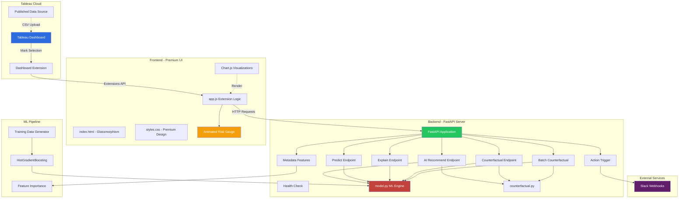
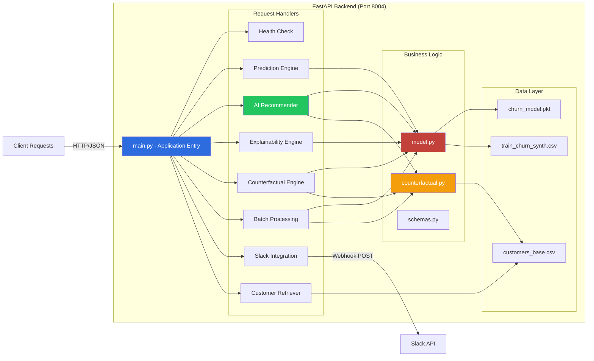
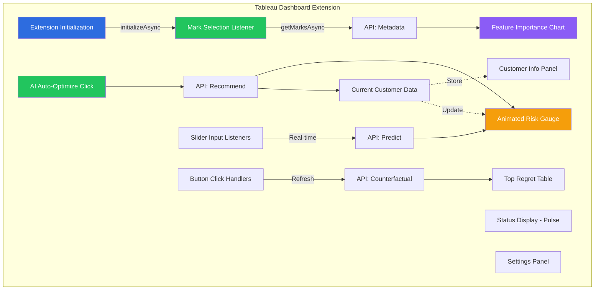

# Counterfactual Command Center — Tableau Cloud E2E

A world-class, hackathon-grade end-to-end solution for Tableau Cloud + AI. This project demonstrates how to integrate real-time Machine Learning and Counterfactual Analysis directly into the flow of work using the Tableau Developer Platform.

## 🚀 "World-Class" Features
- **Predictive Churn Engine**: Uses a HistGradientBoosting model to predict churn risk based on 30-day behavior metrics.
- **Agentic AI Recommender**: A new intelligence layer that automatically identifies the optimal intervention strategy (Action + Timing) to maximize retention for a specific customer.
- **Premium Visual Polish**: Features a state-of-the-art **Glassmorphism** design system, premium **Outfit** typography, and smooth micro-animations.
- **Animated Risk Gauge**: A real-time CSS-based semi-circular gauge that visually represents simulated risk changes as you adjust sliders.
- **Interactive "What-If" Simulator**: Real-time sliders in the Tableau Dashboard allow users to simulate how changes in customer behavior impact their risk score.
- **Explainable AI (XAI)**: Integrated feature importance charts and **Natural Language Reasoning** for AI recommendations to explain *why* an action is suggested.
- **Deep Tableau Integration**: Listens to `MarkSelectionChanged` events for instant, context-aware analysis.
- **Actionable Analytics**: One-click "Trigger Retention Action" that posts high-regret customers to Slack via webhooks.

## 🏗️ Architecture

### Complete System Architecture


### Backend Architecture


### Frontend Extension Architecture


## 🛠 Setup & Local Development

### 1) Prerequisites
- Python 3.11+
- Tableau Cloud Developer Site (Get one at [tableau.com/developer](https://tableau.com/developer))

### 2) Install Dependencies
```bash
python3 -m venv venv
source venv/bin/activate
pip install -r backend/requirements.txt
```

### 3) Generate Data & Train Model
This script generates synthetic customer data, trains the ML model, and exports the base scenario CSVs to the `outputs/` folder.
```bash
export PYTHONPATH=$PYTHONPATH:.
python3 scripts/run_demo.py
```

### 4) Start the Application
You need to run the Backend and the Extension UI simultaneously.

**Backend (Port 8004):**
```bash
source venv/bin/activate
export PYTHONPATH=$PYTHONPATH:.
uvicorn backend.main:app --reload --port 8004
```

**Extension UI (Port 3004):**
```bash
cd extension
python3 -m http.server 3004
```

## ☁️ Deployment (Render.com)
This project is pre-configured for **Docker-based deployment** on Render.

1. **GitHub**: Push this repository to GitHub.
2. **Render**: Create a new **Web Service** on [Render.com](https://render.com).
3. **Config**: 
   - Environment: **Docker**
   - Environment Variable: `PORT` = `8004`
4. **Tableau**: Once deployed, update the `url` in `extension/counterfactual-command-center.trex` to your Render URL.

## 📊 Tableau Cloud Integration
1. **Data**: Upload `outputs/customers_scored_base.csv` as a Published Data Source.
2. **Dashboard**: Create a workbook, add a bar chart of `Customer Id` vs `Churn Risk Base`.
3. **Extension**: Drag the "Extension" object onto your dashboard and select the `extension/counterfactual-command-center.trex` file.
4. **Security**: Add your extension URL (Localhost or Render) to the **Safe List** under Site Settings -> Extensions.

## 🎥 Submission Requirements
- **Video**: Record a 3-5 minute demo showing the "What-If" simulator and Slack trigger.
- **Documentation**: Use the Devpost "Project Story" to explain the Decision Regret logic.
- **Deadline**: Monday, January 12th @ 12:00pm PST.

## 🔑 Environment Variables
- `SLACK_WEBHOOK_URL`: (Optional) URL for Slack notifications.
- `MODEL_PATH`: (Optional) Custom path to saved model.
- `BASE_CUSTOMERS_CSV`: (Optional) Custom path to customer data.
